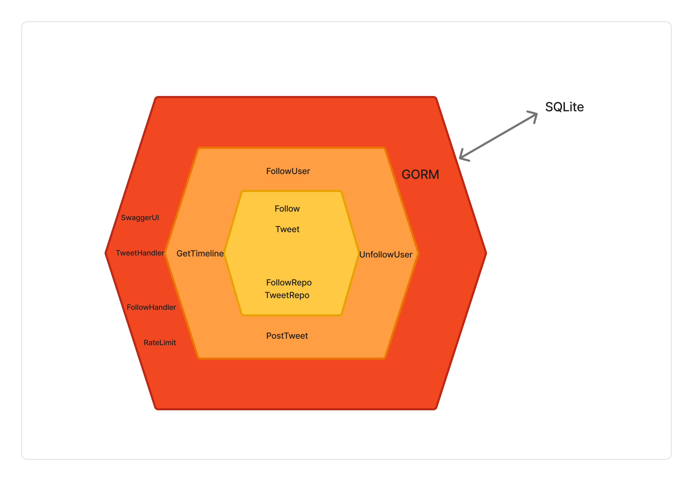
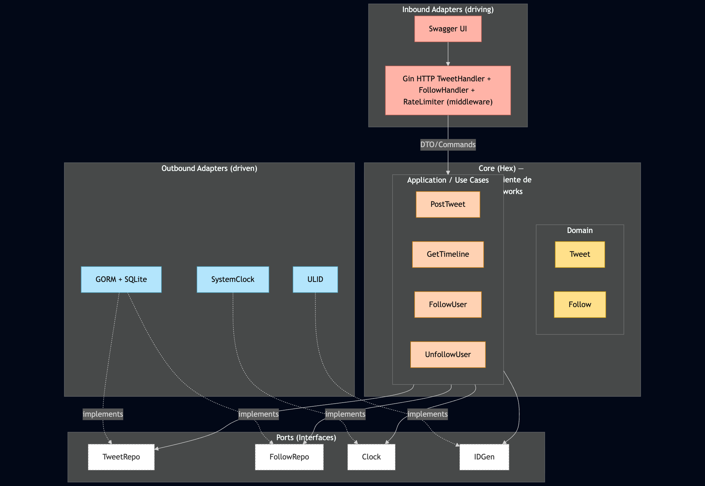

# TweetsChallenge — Go 

Proyecto en Go **1.22+** con **Arquitectura Hexagonal (Ports & Adapters)**. Incluye:

- HTTP API con **Gin**.
- **GORM + SQLite en memoria** (DSN único por instancia para aislar tests).
- **Swagger/OpenAPI** (con `swag` CLI).
- **Rate limit por usuario** (in‑memory, configurable por **variables de entorno**).
- **Makefile** y **Dockerfile**.
- **Tests unitarios e integración** + cobertura.

---

## 📌 ¿Por qué DB en memoria?
Para este challenge priorizamos **setup mínimo** y **tests rápidos**. SQLite **in‑memory** nos da:

- **Cero dependencias externas** (corre en cualquier entorno).
- **Tests veloces y aislados**: usamos un **DSN único por instancia** (`file:mem_<nanos>?mode=memory&cache=shared`) para que **cada servidor/test tenga su propia DB** (evita que un test contamine a otro).
- **Menor complejidad** para enfocarnos en **dominio y API**.

**Contras**: los datos se **pierden al reiniciar** y no escala horizontal sin un backend compartido. Para producción, la migración natural es a **PostgreSQL** (nuevo adapter) y, si hace falta, cache/eventos.

---

## 🧱 Arquitectura (Hexagonal)
- **Domain**: entidades y reglas de negocio (`Tweet`, `Follow`).
- **Application / Use Cases**: orquestan el dominio (`PostTweet`, `GetTimeline`, `FollowUser`, `UnfollowUser`).
- **Ports**: interfaces (`TweetRepo`, `FollowRepo`, `Clock`, `IDGen`).
- **Adapters**: 
  - **HTTP** (Gin): handlers, router, **rate‑limit**.
  - **DB** (GORM/SQLite): repos de persistencia.
  - **Infra**: `SystemClock`, `ULID`.
- **Bootstrap**: `wire.go` arma dependencias e inyecta todo.

### 🖼️ Diagramas de arquitectura

> 
> 

---

## ✨ Endpoints (v1)
- **Tweets**
  - `POST /v1/tweets` — crear tweet (**rate‑limited por usuario**).
  - `GET  /v1/timeline/{userID}` — timeline que muestra **tweets de los usuarios que sigo** (no incluye los propios).
- **Follows**
  - `POST   /v1/follows` — seguir (idempotente).
  - `DELETE /v1/follows` — dejar de seguir (idempotente).
- **Utilidad**
  - `GET /healthz`
  - `GET /swagger/*` — UI de Swagger.

### Respuestas y errores
- `201` creación OK, `200` lecturas, `204` delete idempotente.
- `400` payload inválido, `422` reglas de dominio, `429` **rate limit excedido**, `500` inesperado.

---

## 🚦 Rate limit por usuario
- **Algoritmo**: ventana fija **in‑memory** por `user_id` en `POST /v1/tweets`.
- **Variables**:
  - `RATE_LIMIT_ENABLED` (default `true`)
  - `RATE_LIMIT_WINDOW_SEC` (default `60`)
  - `RATE_LIMIT_MAX_TWEETS` (default `20`)
- Si se excede → **`429 Too Many Requests`**.

> Futuro: backend Redis para rate limiting distribuido (manteniendo la misma interfaz).

---

## ⚙️ Variables de entorno
```
PORT=8080                  # puerto HTTP que escucha la app
GIN_MODE=release|debug     # modo de Gin
RATE_LIMIT_ENABLED=true
RATE_LIMIT_WINDOW_SEC=60
RATE_LIMIT_MAX_TWEETS=20
# Tests/Debug (opcional): forzar DSN
SQLITE_DSN=
```

> Nota `.env`: Go **no** lee `.env` automáticamente.
> - Opción A (código): `github.com/joho/godotenv` (cargar al inicio de `main()`).
> - Opción B (Makefile): `set -a; . .env; set +a; go run ./cmd/api`.

Ejemplo `.env`:
```
PORT=9090
GIN_MODE=release
RATE_LIMIT_ENABLED=true
RATE_LIMIT_WINDOW_SEC=60
RATE_LIMIT_MAX_TWEETS=20
```

---

## ▶️ Cómo levantar

### Requisitos
- Go **1.22+**.
- (Opcional) `swag` CLI para generar Swagger.

### Makefile
```bash
make deps          # go mod tidy
make run           # levanta la API (respeta variables de entorno)
make test          # tests
make swagger       # genera /docs con OpenAPI
```

**Sin Makefile**:
```bash
# con .env cargado por shell
set -a; . .env; set +a
go run ./cmd/api
```

### Docker
```bash
docker build -t tweetschallenge:local .
docker run --rm -e PORT=8080 -p 8080:8080 tweetschallenge:local
# o con .env
docker run --rm --env-file .env -p $PORT:$PORT tweetschallenge:local
```

---

## 📜 Swagger
1) Instalar CLI (una vez):
```bash
go install github.com/swaggo/swag/cmd/swag@v1.16.3
```
2) Generar docs:
```bash
make swagger
```
3) Abrir: `http://localhost:8080/swagger/index.html`

---

## 🧪 Tests & Cobertura
- Unitarios: dominio, casos de uso, rate limiter, adapters.
- Integración: HTTP end‑to‑end con GORM in‑memory (DSN único por instancia).
```bash
GIN_MODE=test go test ./... -v
go test -coverpkg=./... ./... -covermode=atomic -coverprofile=coverage.out -v
go tool cover -func=coverage.out | tail -n1
go tool cover -html=coverage.out -o coverage.html
```

---

## 📦 Estructura
```
.
├── cmd/api/main.go
├── internal/
│   ├── bootstrap/wire.go
│   ├── domain/ (Tweet, Follow)
│   ├── ports/  (TweetRepo, FollowRepo, Clock, IDGen)
│   ├── application/usecase/ (...)
│   └── adapters/
│       ├── http/ (handlers, router, rate limit)
│       ├── db/   (GORM repos, SQLite in‑memory)
│       ├── clock/system_clock.go
│       └── id/ulid.go
├── docs/ (swagger)
├── Makefile
├── Dockerfile
└── README.md
```

---

## 🌍 Hosting
Url pública del sitio:
  👉 **https://tweets-challenge.fly.dev/swagger/index.html**


---

## 🗺️ Roadmap breve
- Adapter **PostgreSQL**.
- Rate limit **Redis** (distribuido).
- Auth (API Key/JWT), métricas y tracing.
- Borrado de tweets y búsqueda.
- Paginación por cursor.
